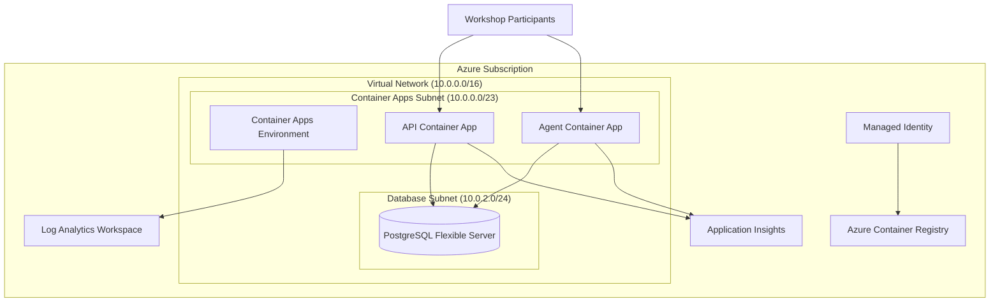

# SRE Agent Hackathon - Infrastructure Deployment

This repository contains the infrastructure-as-code (IaC) templates and deployment scripts for the SRE Agent Hackathon workshop.

## 📋 Table of Contents

- [Overview](#overview)
- [Architecture](#architecture)
- [Prerequisites](#prerequisites)
- [Two-Phase Deployment](#two-phase-deployment)
- [Manual Deployment](#manual-deployment)
- [Troubleshooting](#troubleshooting)
- [Clean Up](#clean-up)

## Overview

The infrastructure is designed to support a production-ready SRE monitoring and alerting system with the following components:

- **Azure Container Apps**: Serverless container hosting for the API and Agent
- **Azure Container Registry (ACR)**: Private container image storage
- **PostgreSQL Flexible Server**: Managed database with private networking
- **Azure Monitor**: Centralized logging and application insights
- **Virtual Network**: Secure network isolation with private endpoints
- **Managed Identity**: Secure authentication without secrets

## Architecture



## ✅ Prerequisites

1. **Azure CLI** installed and configured
   ```bash
   # Install Azure CLI (if not already installed)
   curl -sL https://aka.ms/InstallAzureCLIDeb | sudo bash
   
   # Login to Azure
   az login
   
   # Set your subscription (if you have multiple)
   az account set --subscription "your-subscription-id"
   ```

2. **Bicep CLI** (automatically installed with Azure CLI 2.20.0+)
   ```bash
   # Verify Bicep is available
   az bicep version
   ```

3. **jq** for JSON processing (required for deployment scripts)
   ```bash
   # Install jq on Ubuntu/Debian
   sudo apt-get install jq
   
   # Install jq on macOS
   brew install jq
   ```

4. **Container Application** ready to deploy
   - Your application should be containerized with a Dockerfile
   - Application should expose health checks on `/health`
   - Environment variables for database connection should be configurable

## Two-Phase Deployment

The deployment is split into two phases to solve the "chicken-and-egg" problem where Container Apps need an image that doesn't exist until ACR is deployed.

### Phase 1: Infrastructure Deployment

Deploys core infrastructure **without** Container Apps:

```bash
cd infra/
./deploy-phase1.sh
```

**What gets deployed:**
- ✅ Azure Container Registry (ACR)
- ✅ Virtual Network with subnets
- ✅ PostgreSQL Flexible Server
- ✅ Log Analytics & Application Insights
- ✅ Managed Identity with ACR access

**Outputs:**
- ACR name and login server
- Infrastructure resource IDs for Phase 2

### Phase 2: Build & Deploy Applications

Builds your container image and deploys Container Apps:

```bash
# Build and push your container image
cd ../src/api  # Adjust path to your application
az acr build --registry <ACR_NAME> --image workshop-api:v1.0.0 .

# Deploy Container Apps
cd ../../infra/
./deploy-phase2.sh
```

**What gets deployed:**
- ✅ Container Apps Environment
- ✅ API Container App
- ✅ Application configuration & secrets

## Manual Deployment

If you prefer to run the deployment manually:

### Step 1: Deploy Infrastructure

```bash
# Create resource group
az group create --name rg-sre-agent-hackathon --location eastus

# Deploy infrastructure
az deployment group create \
  --resource-group rg-sre-agent-hackathon \
  --template-file infrastructure.bicep \
  --parameters \
    environmentName=dev \
    baseName=sreagent \
    postgresAdminPassword='YourSecurePassword123!'
```

### Step 2: Build Container Image

```bash
# Get ACR name from deployment output
ACR_NAME=$(az deployment group show \
  --resource-group rg-sre-agent-hackathon \
  --name infrastructure \
  --query "properties.outputs.acrName.value" \
  --output tsv)

# Build and push image
az acr build \
  --registry $ACR_NAME \
  --image workshop-api:v1.0.0 \
  --file src/api/Dockerfile \
  src/api
```

### Step 3: Deploy Applications

```bash
# Get ACR login server
ACR_LOGIN_SERVER=$(az deployment group show \
  --resource-group rg-sre-agent-hackathon \
  --name infrastructure \
  --query "properties.outputs.acrLoginServer.value" \
  --output tsv)

# Deploy applications
az deployment group create \
  --resource-group rg-sre-agent-hackathon \
  --template-file apps.bicep \
  --parameters \
    environmentName=dev \
    baseName=sreagent \
    containerImageRegistry=$ACR_LOGIN_SERVER \
    containerImageName=workshop-api:v1.0.0 \
    postgresAdminPassword='YourSecurePassword123!'
```

## 🧪 Testing Your Deployment

After successful deployment, test your API:

```bash
# Get API URL
API_URL=$(az deployment group show \
  --resource-group rg-sre-agent-hackathon \
  --name apps \
  --query "properties.outputs.apiContainerAppUrl.value" \
  --output tsv)

# Test health endpoint
curl $API_URL/health

# Test other endpoints
curl $API_URL/api/metrics
```

## 📊 Monitoring & Observability

### Application Insights

Your applications are automatically configured with Application Insights for:
- ✅ Request tracking
- ✅ Dependency monitoring  
- ✅ Exception logging
- ✅ Performance metrics

### Log Analytics

Container logs are forwarded to Log Analytics. Query them with:

```kql
// View recent container logs
ContainerAppConsoleLogs_CL
| where TimeGenerated > ago(1h)
| order by TimeGenerated desc

// View application requests
AppRequests
| where TimeGenerated > ago(1h)
| order by TimeGenerated desc
```

### Metrics & Alerts

Key metrics to monitor:
- Container App CPU/Memory usage
- Database connections and performance
- API response times and error rates
- Container restart counts

## Troubleshooting

### Common Issues

**1. Container App won't start**
```bash
# Check container logs
az containerapp logs show \
  --name <CONTAINER_APP_NAME> \
  --resource-group rg-sre-agent-hackathon
```

**2. Database connection issues**
```bash
# Verify database server is running
az postgres flexible-server show \
  --name <POSTGRES_SERVER_NAME> \
  --resource-group rg-sre-agent-hackathon

# Check network connectivity
az containerapp exec \
  --name <CONTAINER_APP_NAME> \
  --resource-group rg-sre-agent-hackathon \
  --command "nc -zv <POSTGRES_FQDN> 5432"
```

**3. ACR authentication issues**
```bash
# Check managed identity has ACR access
az role assignment list \
  --assignee <MANAGED_IDENTITY_ID> \
  --scope /subscriptions/<SUBSCRIPTION_ID>/resourceGroups/rg-sre-agent-hackathon/providers/Microsoft.ContainerRegistry/registries/<ACR_NAME>
```

### Resource Naming

All resources follow this naming convention:
- Format: `{baseName}-{environment}-{resourceType}-{uniqueSuffix}`
- Example: `sreagent-dev-api-abc123def`

### Configuration Updates

To update container configuration without redeployment:
```bash
az containerapp update \
  --name <CONTAINER_APP_NAME> \
  --resource-group rg-sre-agent-hackathon \
  --set-env-vars "NEW_VAR=value"
```

## 🧹 Clean Up

To delete all resources:

```bash
# Delete the entire resource group (WARNING: This deletes everything!)
az group delete --name rg-sre-agent-hackathon --yes --no-wait
```

To delete specific deployments:
```bash
# Delete applications only (keeps infrastructure)
az deployment group delete \
  --resource-group rg-sre-agent-hackathon \
  --name apps

# Delete infrastructure
az deployment group delete \
  --resource-group rg-sre-agent-hackathon \
  --name infrastructure
```

## Additional Resources

- [Azure Container Apps Documentation](https://docs.microsoft.com/en-us/azure/container-apps/)
- [Azure Bicep Documentation](https://docs.microsoft.com/en-us/azure/azure-resource-manager/bicep/)
- [PostgreSQL Flexible Server Documentation](https://docs.microsoft.com/en-us/azure/postgresql/flexible-server/)
- [Application Insights Documentation](https://docs.microsoft.com/en-us/azure/azure-monitor/app/app-insights-overview)

---

## 🤝 Contributing

This infrastructure code is part of the SRE Agent Hackathon workshop. Feel free to submit issues and enhancement requests!